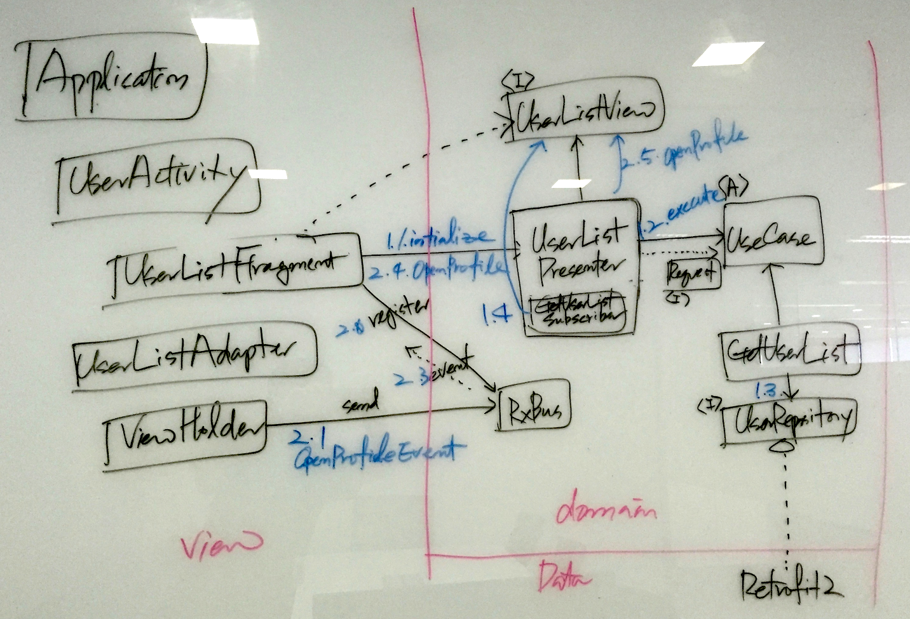

# Clean Architecture 참조 구현

이 예제는 [RxJava Essentials](https://www.packtpub.com/application-development/rxjava-essentials) 나오는 예제에

- dagger2
- butterknife
- retrofit2
- mvp
- robolectric
- kotlin(?)

등을 적용하여 Robert C Martin의 Clean Architecture와 유사한 구조를 갖도록 하는 것을 목적으로 한다.

## Architecture

- 정정1 RxBus는 Domain이 아니라 View 영역에 존재

view, domain, data로 레이어가 나눠지고, 모든 소스 코드의 의존성은 domain을 향한다.

- User List Loading
	- 1.1 view(UserListFragment)가 생성되면 view는 presenter(UserListPresenter)에 initialize를 호출한다.
	- 1.2 presenter는 GetUserList::execute(UserListRequest, GetUserListSubscriber)를 호출한다.
    	- UserListRequest는 pageNo를 전달하기 위한 DS(Data Structure)이다.
    	- GetUserListSubscriber는 RxJava를 이용한 Subscriber로써 UserListPresenter의 inner class로 구현된다.
	- 1.3 usecase(GetUserList)는 repository(UserRepository)를 호출하여 결과를 Observable로 받고, 적절한 가공(map(UsersResponse::getUsers)) 후에 반환한다.
    - 1.4 presenter를 view(UserListView)를 호출하여 화면에 결과가 출력되도록 한다.

- Open User Profile
	- 2.0 View는 RxBus에 자신을 등록(subscribe)한다.
	- 2.1 ViewHolder에서 click 이벤트가 발생하면 singleton으로 제공되는 RxBus를 이용하여 이벤트(OpenProfileEvent)를 발생시킨다.
	- 2.3(numbering 오류) RxBus는 이벤트를 수신자들에게 전달한다.
    - 2.4 view(UserListFragment)는 presenter를 호출한다.
    - 2.5 presenter는 로직을 수행하고 결과를 view에 전달하여 출력되도록 한다.
    
## 기타 추가 문서

### Dagger2
- [Dependency Injection with Dagger 2](https://guides.codepath.com/android/Dependency-Injection-with-Dagger-2) 이 글이 dagger2를 처음 본다면 더 좋은 글일 듯
- [Tasting Dagger 2 on Android](http://fernandocejas.com/2015/04/11/tasting-dagger-2-on-android/)

### Architecture
- [Architecting Android…The clean way?](http://fernandocejas.com/2014/09/03/architecting-android-the-clean-way/#_jmp0_)
- [Architecting Android…The evolution](http://fernandocejas.com/2015/07/18/architecting-android-the-evolution/)
- [Android Application Architecture — ribot labs](http://wiki.daumkakao.com/pages/viewpage.action?pageId=366847933)
- [STINSON'S PLAYBOOK FOR MOSBY - 정리 중](http://wiki.daumkakao.com/display/CommunityDev1/STINSON%27S+PLAYBOOK+FOR+MOSBY)