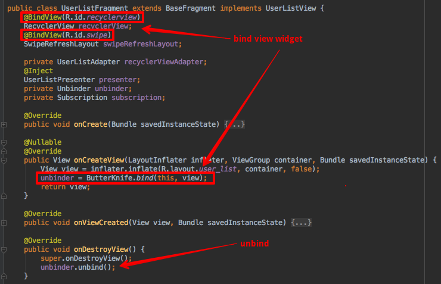
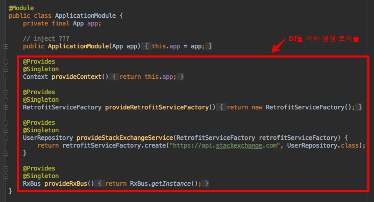
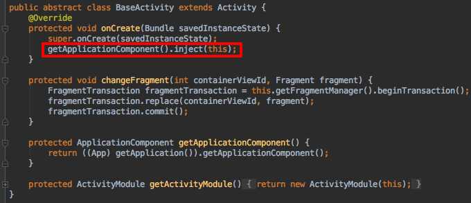
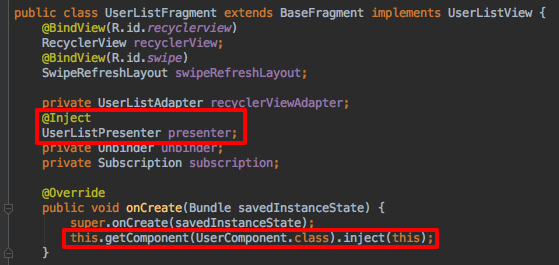
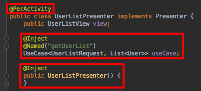
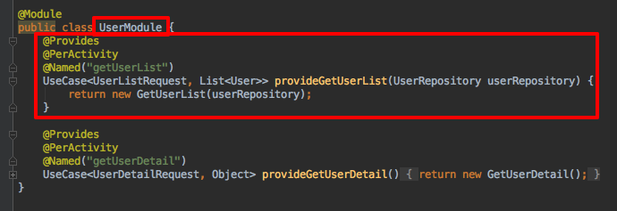
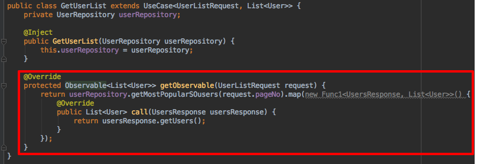
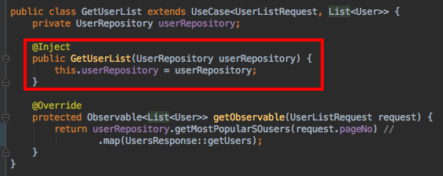

# Clean Architecture 참조 구현

이 예제는 [RxJava Essentials](https://www.packtpub.com/application-development/rxjava-essentials) 나오는 예제에

- retrolambda
- dagger2
- butterknife
- retrofit2
- mvp
- robolectric
- kotlin(?)

등을 적용하여 Robert C Martin의 Clean Architecture와 유사한 구조를 갖도록 하는 것을 목적으로 한다.

## Architecture


- **정정1 RxBus는 Domain이 아니라 View 영역에 존재**

view, domain, data로 레이어가 나눠지고, 모든 소스 코드의 의존성은 domain을 향한다.

- User List Loading
	- 1.1 view(UserListFragment)가 생성되면 view는 presenter(UserListPresenter)에 initialize를 호출한다.
	- 1.2 presenter는 GetUserList::execute(UserListRequest, GetUserListSubscriber)를 호출한다.
    	- UserListRequest는 pageNo를 전달하기 위한 DS(Data Structure)이다.
    	- GetUserListSubscriber는 RxJava를 이용한 Subscriber로써 UserListPresenter의 inner class로 구현된다.
	- 1.3 usecase(GetUserList)는 repository(UserRepository)를 호출하여 결과를 Observable로 받고, 적절한 가공(map(UsersResponse::getUsers)) 후에 반환한다.
    - 1.4 presenter를 view(UserListView)를 호출하여 화면에 결과가 출력되도록 한다.

- Open User Profile
	- 2.0 View는 RxBus에 자신을 등록(subscribe)한다.
	- 2.1 ViewHolder에서 click 이벤트가 발생하면 singleton으로 제공되는 RxBus를 이용하여 이벤트(OpenProfileEvent)를 발생시킨다.
	- 2.3(numbering 오류) RxBus는 이벤트를 수신자들에게 전달한다.
    - 2.4 view(UserListFragment)는 presenter를 호출한다.
    - 2.5 presenter는 로직을 수행하고 결과를 view에 전달하여 출력되도록 한다.

## 사용된 Library

### 1 Retrolambda

#### 1.1 설정하기


- buildscript에 dependencies에 `classpath "me.tatarka:gradle-retrolambda:$retrolambda_version"` 추가
- `apply plugin: 'me.tatarka.retrolambda'` 추가

#### 1.2 잇점


listener가 [SAM](https://dzone.com/articles/introduction-functional-1) 이라면 interface를 사용하지 않고, method reference를 사용할 수 있어서 interface 감소, implements 간소화 등의 잇점이 있음.

또한 Java8의 Lambda를 보다 효과적으로 사용할 수 있음.

### 2. Butterknife

#### 2.1 설정하기

build.gradle에 아래와 같이 의존성 추가

```
compile 'com.jakewharton:butterknife:8.0.1'
apt 'com.jakewharton:butterknife-compiler:8.0.1'
```

#### 2.2 잇점

다양한 잇점이 있겠으나 View Widget을 쉽게 바인딩 가능



### 3. retrofit2

#### 3.1 설정하기

build.gradle에 아래와 같이 의존성 추가

```
compile 'com.squareup.retrofit2:retrofit:2.0.2'
compile 'com.squareup.retrofit2:converter-gson:2.0.2'
compile 'com.squareup.retrofit2:adapter-rxjava:2.0.2'
```

#### 3.2 잇점

아래와 같이 interface 정의만으로 REST 호출을 처리 가능

```
public interface UserRepository {
    @GET("/2.2/users?order=desc&pagesize=10&sort=reputation&site=stackoverflow")
    Observable<UsersResponse> getMostPopularSOusers(@Query("page") int page);
}
```

RxJava를 위한 Observable 반환이 인상적.

아래와 같이 서비스를 생성할 수 있음.

```
public class RetrofitServiceFactory {
    public <T> T create(String baseUrl, Class<T> serviceClass) {
        Retrofit retrofit = new Retrofit.Builder()
                .baseUrl(baseUrl)
                .addConverterFactory(GsonConverterFactory.create())
                .addCallAdapterFactory(RxJavaCallAdapterFactory.create())
                .build();
        return retrofit.create(serviceClass);
    }
}

...
        return retrofitServiceFactory.create("https://api.stackexchange.com", UserRepository.class);
```

### 4. RxJava

#### 4.1 설정하기

build.gradle에 아래와 같이 의존성 추가

```
compile 'io.reactivex:rxandroid:1.2.0'
compile 'com.jakewharton.rxbinding:rxbinding:0.4.0'
compile 'io.reactivex:rxjava-joins:0.22.0'
```

#### 4.2 잇점

**retrofit 사용의 차이로 본 RxJava의 잇점**


### 5. Dagger2

#### 5.1 설정하기

build.gradle에 아래와 같이 의존성 추가

```
apt 'com.google.dagger:dagger-compiler:2.2'
compile 'com.google.dagger:dagger:2.2'
provided 'javax.annotation:jsr250-api:1.0'
```

아래 참고 문서의 dagger2 관련 아티클 참고

Dagger는 Component, Module에 Binding, 제공될 DI 객체들을 정의하고, 사용하는 소스에서는 @Inject 어노테이션을 통해 주입받는다. Activity, Fragment 등에서는 component에 대한 참조를 얻어서 자기 자신을 전달하며 inject 메소드를 호출해야 의존성이 주입된다.

#### 5.2 Component


component는 
- DI로 제공될 객체들을 생성할 모듈(ApplicationModule)
- Injection이 일어날 대상(BaseActivity)
- DI로 제공될 객체들(Context, RetrofitServiceFactory, UserRepository, RxBus)

등을 정의한다.

`@Singleton`은 이 컴포넌트가 애플리케이션에 한개만 존재하도록 한다.

#### 5.3 Module



module은 DI로 제공할 객체들(Context, RetrofitServiceFactory, UserRepository, RxBus)을 생성하는 로직들과 DI 메소드(inject(XXXActivity) 등을 가질 수 있다.

#### 5.4 Application


#### 구조

Application > Activity > User 레벨로 Component/Module을 구성하고 하위의 Component는 상위의 Component에 의존한다. scope도 Activity, User는 @PerActivity(custom)으로 사용자 별로 존재하도록 구성

#### 사용 예

activity, fragment 등이 DI 되기 위해서는 아래와 같이 inject 메소들 호출해야 한다.





inject 메소드가 호출되면 dagger는 해당 클래스에서 @Inject로 명시된 필드들에 대해서 DI를 수행한다.

위 그림과 같이 UserListFragment가 inject를 수행하면 UserListPresenter가 inject된다.



@PerActivity scope을 갖는 UserListPresenter는 getUserList라는 이름을 갖는 UseCase를 Inject 받도록 정의되어 있고, @Inject를 갖는 생성자를 갖는다. 

**UserListPresenter는 어떠한 Module에도 정의되어 있지 않다. <-- Module에 정의하지 않고 클래스 선언 위에 scope을 정의하고 Inject될 수 있는 객체 정의가 가능한 듯**

**어떤 경우는 module에 정의하고, 어떤 경우는 그럴 필요가 없을까 ???
...........................................................** 





참고로 아래는 retrolambda를 사용했을 때의 코드이다(간결. lambda, method reference로 인해)


## MVP

뷰 객체의 라이프싸이클 메소드에서 Presenter의 라이프싸이클 메소드 호출이 필요

```
@Override
public void onDestroy() {
    super.onDestroy();
    presenter.destroy();
}

@Override
public void onResume() {
    super.onResume();
    presenter.resume();
}

@Override
public void onPause() {
    super.onPause();
    presenter.pause();
}
```

아래와 같은 흐름을 가짐

- View(Activity, Fragment, Adapter, ViewHolder 등)에서 이벤트 발생
- View는 이벤터 처리를 presenter에 요청
- presenter는 필요한 경우 view의 메소드 호출(showProgressBar 등)
- presenter는 UseCase를 호출한다.
	- 이때 Subscriber, UseCaserRequest를 파라미터로 전달한다.
- Subscriber에서 UserCase가 반환한 결과를 View가 사용하기 적합한 타입으로 변환한다.
- Subscriber에서 변한한 타입을 View의 메소드 호출을 통해 전달한다.
- View는 전달받은 결과를 화면에 출력한다.

View와 Presenter가 1:1로 매핑되기 어려운 경우가 존재

1. fragment - recyclerview - adapter - viewholder가 있고 viewholder에서 발생한 이벤트가 fragment에 전달되어어 하는 경우.
2. 하나의 뷰에서 발생한 이벤트의 결과가 2개 이상의 다른 뷰에 갱신되어어야 하는 경우

이러한 경우에는 이벤트 버스(RxBus, Otto 등)를 사용하는 것이 의존성 관리에 적합할 것 같다. 이벤트 버스를 사용하지 않는다면 1의 경우 fragment -> adapter -> viewholder로 fragment나 listener method의 참조가 전달되어야 한다. ㅠㅠ


## 참고문서

### Dagger2
- [Dependency Injection with Dagger 2](https://guides.codepath.com/android/Dependency-Injection-with-Dagger-2) 이 글이 dagger2를 처음 본다면 더 좋은 글일 듯
- [Tasting Dagger 2 on Android](http://fernandocejas.com/2015/04/11/tasting-dagger-2-on-android/)

### Architecture
- [Architecting Android…The clean way?](http://fernandocejas.com/2014/09/03/architecting-android-the-clean-way/#_jmp0_)
- [Architecting Android…The evolution](http://fernandocejas.com/2015/07/18/architecting-android-the-evolution/)
- [Android Application Architecture — ribot labs](http://wiki.daumkakao.com/pages/viewpage.action?pageId=366847933)
- [STINSON'S PLAYBOOK FOR MOSBY - 정리 중](http://wiki.daumkakao.com/display/CommunityDev1/STINSON%27S+PLAYBOOK+FOR+MOSBY)